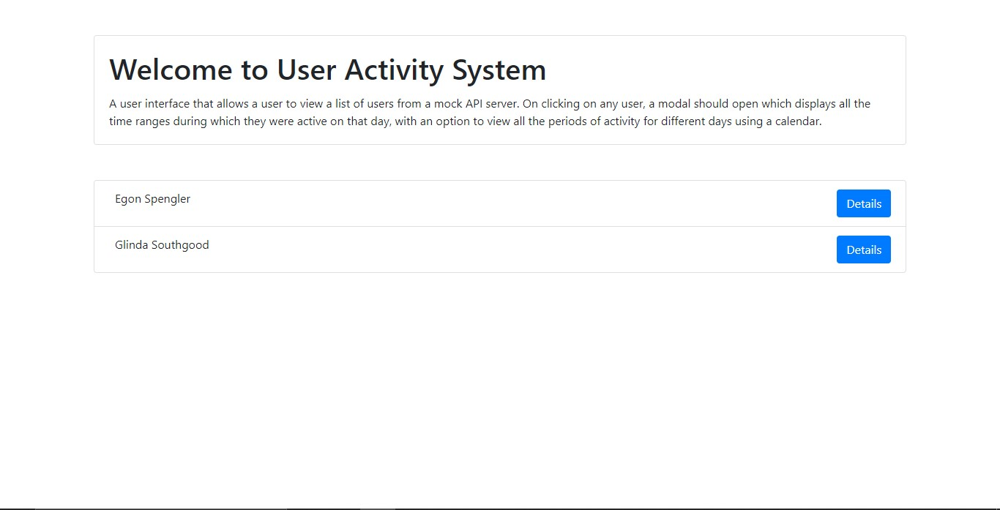
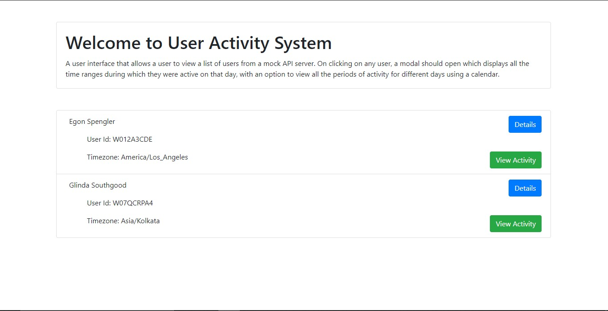
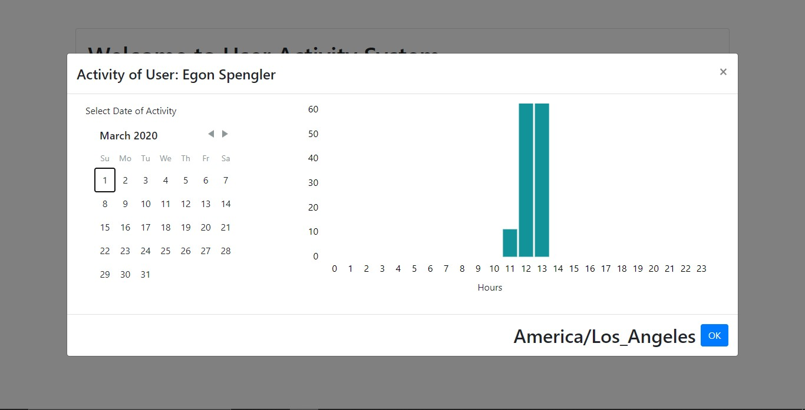

# User-Activity-Management
This is an Assignment project that is built using React framwork for UI. The user interface that allows a user to view a list of users from a mock API server. On clicking on any user, a modal should open which displays all the time ranges during which they were active on that day, with an option to view all the periods of activity for different days using a calendar.

## Link to Project
To view the real working Project visit [!https://amangoel998.github.io/User-Activity-Management/](https://amangoel998.github.io/User-Activity-Management/) and see the whole illustration.

## Additional Information
- I have used react-bootstrap package to implement bootstrap based frontend components.
- The Date picker let's to choose the day of Activity for a person.

## Home Page
 The Home Page for Screen with the List of Users

## Expandable List
 The List objects are expandable with details about User Id and their respective Time Zones

## Activity Modal
 The Modal which appears after clicking Activity Button contains Calendar

